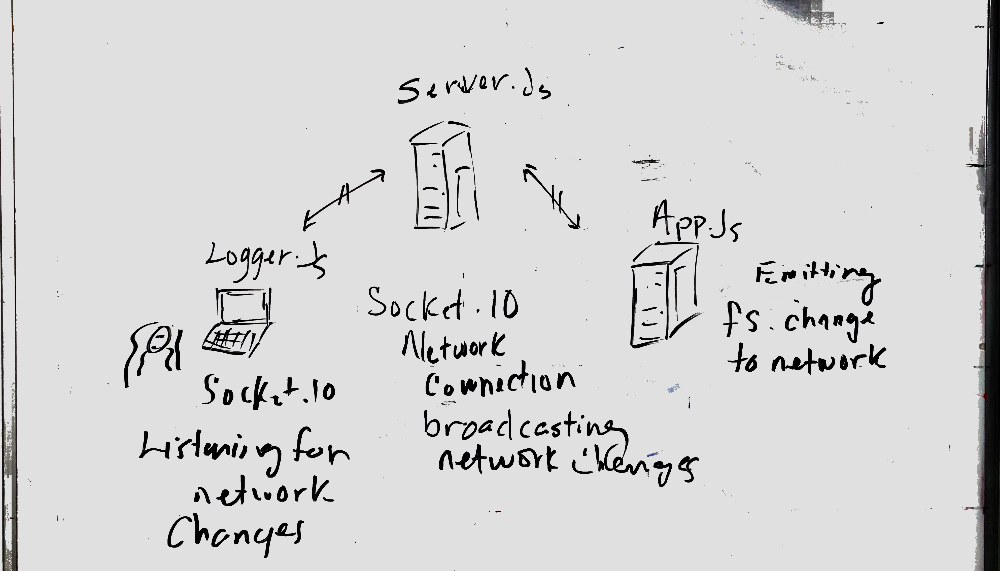

# LAB - 18

## Socket.IO Network

### Author: Jeremy Lee

### Links and Resources

- [submission PR](http://xyz.com)
- [travis](http://xyz.com)

#### Documentation

- [jsdoc](http://xyz.com) (Server assignments)

### Modules

#### `modulename.js`

##### Exported Values and Methods

### Setup

#### `.env` requirements

- `http://localhost:3000` - Port Number

#### Running the app

- `node server.js`
- Endpoint: `http://localhost:3000`
  - Emmits an object with payload in dicating file change.

#### Tests

- How do you run tests?
- What assertions were made? 🤔

#### UML

